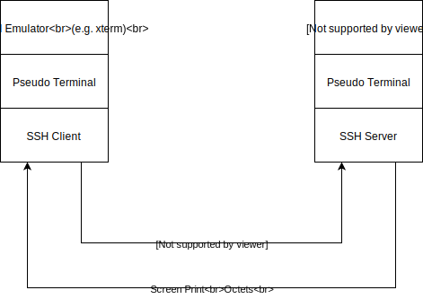
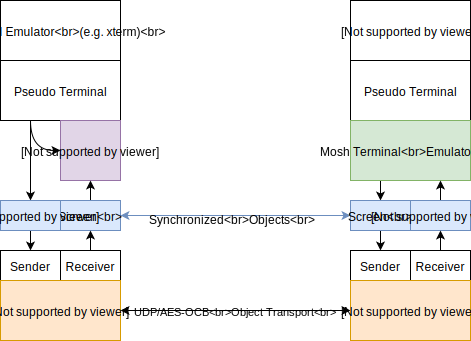
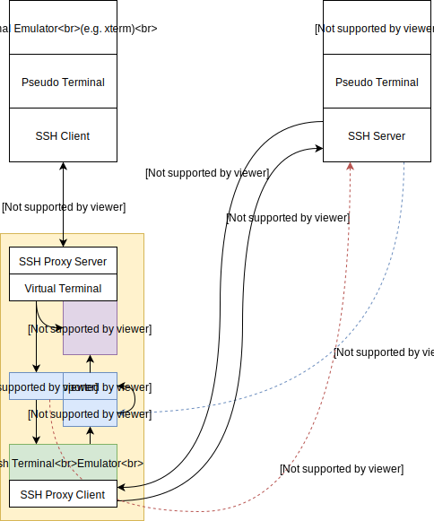

Nosshtradamus
=============
An SSH proxy server supporting speculative echo and line editing for interactive sessions; using the Mosh prediction
engine and terminal emulator.

> Mosh is a remote terminal application that supports intermittent connectivity, allows roaming, and provides
> speculative local echo and line editing of user keystrokes.

Nosshtradamus enables a subset of the benefits provided by Mosh for unmodified SSH server and clients on both ends of
a connection (specifically: instantaneous predictive responses to user input). No additional software is required on the
SSH server side to achieve these benefits.

Standard SSH Remote Terminals
-----------------------------


The Secure Shell (SSH) protocol is a cryptographic network protocol for operating network services over untrusted
networks. Applications over the SSH protocol include remote login to interactive terminal shells, file transfer, network
connection tunneling, and graphical application forwarding (e.g. X11 applications on remote UNIX systems).

An SSH client establishes a cryptographically protected and authenticated TCP network connection to an SSH server, then
within that connection initiates one or more octet stream channels required to service a specific application. In
addition to carrying a bidirectional octet stream, these channels support initiating requests and transmitting responses
from both ends of the channel. These channels provide simple yet flexible building blocks.

For interactive terminal shells, a client requests the allocation of a pseudo-terminal on the server followed by a
request to execute the shell binary on the server. Keystrokes entered by the user are carried over the channel to the
server and fed into the pseudo-terminal. Responses to user keystrokes (including typed character echo) are processed by
the server and updates to the screen are then carried back to the client.

When operating interactive terminal shell sessions over marginal, high latency, or low bandwidth network links, the user
experience can be very frustrating, since visual acknowledgement of keystrokes requires a full network round trip.
Further, as SSH is a network protocol built on top of TCP, there is limited support for network roaming or responsively
terminating transmission of output from runaway remote processes (e.g. Ctrl-C of rapid console output).

Mosh Remote Terminals
---------------------


Mosh initiates connections to a remote server over SSH, but only keeps that connection open long enough to start a
(previously installed) `mosh-server` on the remote system and then initiates a separate (UDP) connection with its local
`mosh-client`.

The `mosh-server` incorporates a special terminal emulator that operates on screen state *objects* rather than raw
terminal octet streams. These objects support calculating difference vectors between two states, and transforming one
object state into another by applying these vectors (diff & patch).

The Mosh network protocol bidirectionally exchanges state update vectors instead of raw terminal octet streams, allowing
a client to request an update vector to the latest server state from the most recent state previously synchronized. This
latest server state may be an arbitrary number of state updates from the previously synchronized state. Since the client
usually wants to know the "current" state of the object (e.g. terminal screen contents), and cares less about
intermediate states, the server can send a compact and relevant vector even if a large quantity of octets were generated
by the pseudo-terminal in the mean time, or if the client has not requested an update for a prolonged period of time.

Additionally, since difference vectors can be applied in a principled way between any state pairs (including blank or
uninitialized terminals), the client has the option to perform local transformations to its own state. This capability
is the basis of Mosh's prediction engine, which will speculatively draw character echo and other line editing
transformations *without waiting for acknowledgement* from the server first. Thus, even on high latency or marginal
network links, the user sees an approximation of the effect or their typing instantaneously. This vastly improves the
user experience by providing response consistency, even if some predictions are incorrect. Mosh underlines
unacknowledged predictions and reconciles both correct and incorrect predictions when state synchronization with the
server completes.

Nosshtradamus Remote Terminals
------------------------------


Nosshtradamus incorporates functional components from Mosh to provide the same quality of instant speculative local
acknowledgement of user inputs, but where the client is a standard SSH client and the server is a standard SSH server.
It operates as an SSH protocol proxy running on the "near" side of the network of the client, or even on the client's
localhost, with a target server specified on the command line. The SSH client is connected to the proxy, and the proxy
itself establishes the connection to the remote host.

SSH channels identified as interactive sessions (by name `session`) are interposed through the predictive terminal
emulator (using Mosh components). All other SSH channels are passed through unmodified (including file transfer, network
tunneling, X11 forwarding, agent forwarding, etc.).

Since there is no component running on the remote server comparable to the `mosh-server`, writes to the remote terminal
through the predictive interposition are immediately followed by a side-band "ping" request. The ping requests are
numbered sequentially in a monotonically increasing fashion. Even if the remote server does not recognize the request,
it will send some response over the channel side-band (subject to the same network performance characteristics as the
in-band carried data). This response is used as a marker to track when terminal output reflects specific inputs
(satisfying update reporting needs of the Mosh prediction engine).

The remote SSH server will still transmit all in-band data to the Nosshtradamus proxy over a potentially marginal
network connection, so this construction does not provide the bandwidth savings of a Mosh UDP state synchronization
protocol connection (and in fact will use slightly more bandwidth than a standard SSH connection due to the additional
side-band requests/responses). Further, there are none of the roaming or responsive Ctrl-C benefits that Mosh confers.
On the positive side, response to user keystrokes into their SSH client will be speculatively reflected instantaneously
by the proxy providing the same response consistency user experience improvements that Mosh does.

### User Authentication

Nosshtradamus supports connecting to remote servers with public key authentication from proxy co-located SSH agents and
identity files (in PEM format, not the newer key format used by e.g. ed25519 keys), as well as arbitrary
`keyboard-interactive` challenges (which are forwarded to the connecting client), and plain-password authentication
(forwarded as a keyboard-interactive challenge to the connecting client). Identity files that are password protected
are supported, but the connecting client will be asked for the password the first time the key is loaded (via
keyboard-interactive challenge).

Since keyboard-interactive challenges likely contain plaintext credentials, Nosshtradamus will default to strict key
authentication in the same fashion as the OpenSSH client. The same options (`-o UserKnownHostsFile=<path>` and
`-o StrictHostKeyChecking=<yes/no>`) are supported on the command line to control this behavior.

The proxy will generate a new SSH host key upon startup.

While it is possible in principle to directly utilize the connecting client's SSH agent to authenticate with the target
service, such a configuration is not straightforward in Go Crypto's SSH library.

Scrollback
----------

Mosh does not support client side terminal scrollback buffers. This is an artifact of the state synchronization protocol
and the choice to synchronize visible screen content state. While Nosshtradamus *does* receive all information from the
remote SSH server necessary for fully populating scrollback, this information is not usable once the in-band data is
processed by the Mosh terminal emulator.

As an alternative, as is suggested in Mosh documentation, use pagers or server side scrollback methods like running
`screen` or `tmux` in the remote terminal to get some scrollback buffer capabilities.

This restriction may be resolved within Nosshtradamus in the future.

Build Notes
-----------

Nosshtradamus is written in Go(lang). Mosh itself is written in C++. The C++ classes required to implement Nosshtradamus
have been wrapped in the [go-mosh](https://gitlab.hive.thyth.com/chronostruct/go-mosh) dependency pulled in as a Go
module.

Due to Go module restrictions, the git submodule reference to the upstream Mosh repository is not pulled when retrieving
the dependency. Further, even if the submodule was pulled, it is not possible to initiate a build of Mosh automatically
in the correct module context (cannot execute arbitrary scripts or `make` for security/safety reasons).

Prior to building Nosshtradamus, check out the Mosh upstream within the Go module directory of 'go-mosh':
`~/go/pkg/mod/gitlab.hive.thyth.com/chronostruct/go-mosh@<version>`, then follow instructions from Mosh upstream to
build the Mosh binaries and object files for your system. After completing the Mosh build in the 'go-mosh' module you
should be able to build Nosshtradamus with an ordinary `go build` invocation.

Usage
-----

The simplest way to start the proxy: `nosshtradamus -port proxy-server-port -target remote-host:remote-port`

Supported command line arguments:
```
  -A
    Allow proxy SSH client to forward agent
  -a
    Disable use of SSH agent for key based authentication
  -authErr
    Show details on authentication errors with target
  -dumbauth
    Use 'dumb' authentication (send blank password)
  -fakeDelay duration
    Artificial roundtrip latency added to sessions
  -i identity file path
    Proxy SSH client identity file paths (repeatable)
  -noBanner
    Disable the Nosshtradamus proxy banner
  -nopredict
    Disable the mosh-based predictive backend
  -o SSH client option
    Proxy SSH client options (repeatable)
  -port int
    Proxy listen port
  -printTiming
    Print epoch synchronization timing messages
  -target string
    Target SSH host
  -version
    Display predictive backend version
```

The artificial latency is a (simple) simulation of a connection with the specified latency between the SSH proxy client
and target SSH server in interactive sessions. The delay is only imposed on the write side, and not on any SSH protocol
level messages (so handshaking and connection initiation are not affected).

Disabling the predictive backend will still proxy communications to the target SSH server (and still support delay),
which can be useful for qualitative user experience comparisons.
